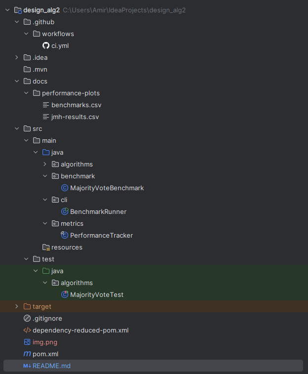

# Majority Vote Algorithm – Assignment 2

This project implements the **Boyer–Moore Majority Vote** algorithm in Java with:
- ✅ CLI benchmark runner
- ✅ JUnit 5 test suite (correctness & edge-cases)
- ✅ Performance tracking with CSV export
- ✅ [JMH](https://openjdk.org/projects/code-tools/jmh/) harness for accurate micro-benchmarks

---

## 📦 Project Structure

assignment2-Majority Vote


---

## ⚙️ Build & Test

Requires **Java 21+** and **Maven 3.9+**.

```bash
# Clone and enter the project
git clone https://github.com/silence99999/assignment2-MajorityVote
cd assignment2-MajorityVote

# Run all unit tests
mvn clean test